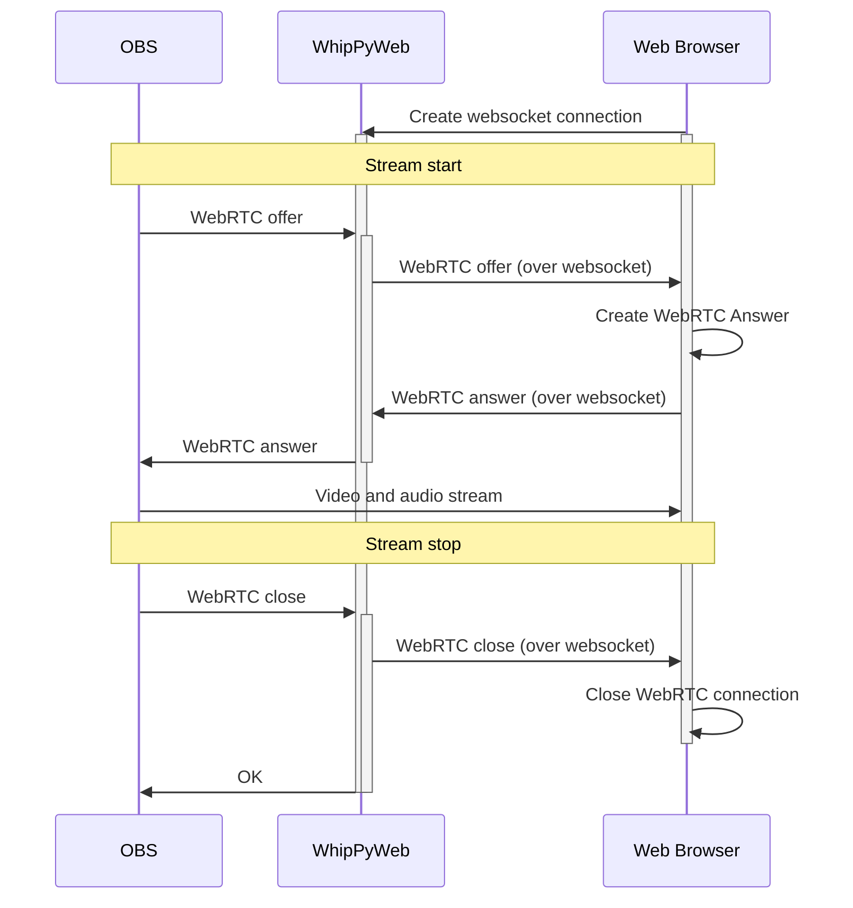
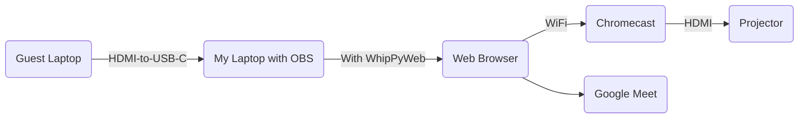

# WhipPyWeb

WhipPyWeb is a Python tool that allows you to stream your desktop to a web browser using WebRTC. It is designed with [OBS](https://obsproject.com/) in mind.

## Installation

You can install WhipPyWeb using pipx:

```bash
pipx install whippyweb
whippyweb run
```

or using Docker:

```bash
docker run -p 8080:8080 whippyweb
```

## Features

- Stream from OBS to a (single) web browser
- Very low latency between OBS and web browser
- You only need the Python server to establish the connection, audio and video are streamed directly from OBS to the web browser - there's no overhead of any Python processing (which can be slow).

## How it works



## How I got here

I wanted to improve the experience of an event I'm hosting. I wanted to stream my desktop to a web browser, to share the screen with my audience both in the same room (Projector with a Chromecast) and remotely (Google Meet sharescreen).

Tried RTMP, HLS but the latency was too much - imagine talking about a slide that is 3-12 seconds away from being visible on the screen...

Eventually stumbled upon [this Medium article](https://medium.com/@contact_45426/ultra-low-latency-streaming-with-obs-whip-whep-and-broadcast-box-fa649bf87fbe) which pointed me to [Broadcast-box](https://github.com/Glimesh/broadcast-box). Broadcast-box in turn, directed me to [OBS2Browser](https://github.com/Sean-Der/OBS2Browser).

Since I wanted to make some changes and I never written a line of code in GO, I decided to write a Python version of OBS2Browser. WhipPyWeb is the result.

Now I can stream from OBS to a web browser, with very low latency.



## Usage

Once `whippyweb` is running, you can access the player at `http://localhost:8080/player`. There you will see instructions on how to configure your OBS instance.

## Contributing

Contributions are welcome! Please open an issue or submit a pull request.

## License

This project is licensed under the MIT License - see the [LICENSE](LICENSE) file for details.
