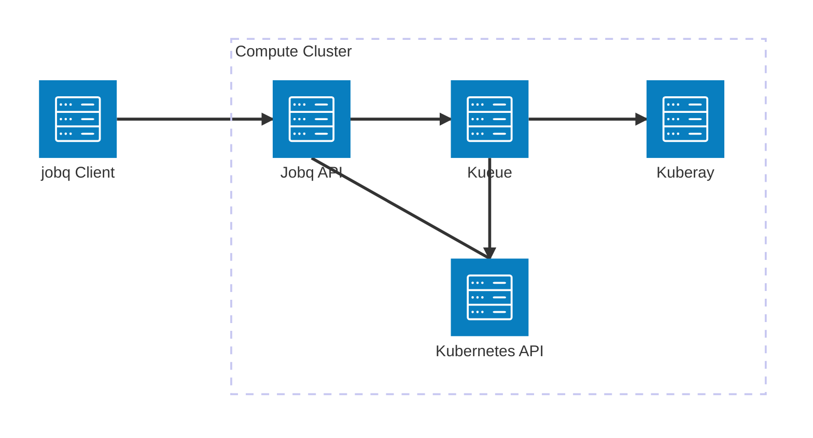

# Understanding the jobq architecture

The jobq high-level architecture consists of two major components:

1. The [_client-side library_](#client-side-library), which is used to declare and submit jobs to a compute cluster.
2. The [_server-side API_](#server-side-api), which serves as the interface between the client and the compute cluster.

## Client-side library

The client-side Python library provides a high-level interface for declaring and executing jobs, either locally or on a compute cluster.
It is designed to be easy to use and to integrate with other Python libraries and frameworks.

The library is responsible for:

-   Providing a `@job` decorator to annotate Python functions as jobs.
-   Configuring the container image build for a job (through a declarative configuration or explicit `Dockerfile`).
-   Setting runtime parameters for a job (e.g., its resource requirements).
-   Managing the lifecycle of jobs, including monitoring their status and logs through a command-line interface.

The library is implemented as a Python package that can be installed using pip.

## Server-side API

The server-side API is a RESTful API that provides a low-level interface for managing jobs in a compute cluster.

It builds on top of Kubernetes and the [Kueue framework](https://kueue.sigs.k8s.io/), which provides a high-level abstraction for managing workloads in a Kubernetes cluster (including queueing, priority-based scheduling, preemption, and resource management).

Kueue itself can manage workloads of various types, such as Kubernetes `Jobs`, Kuberay `RayJobs`, among others.
