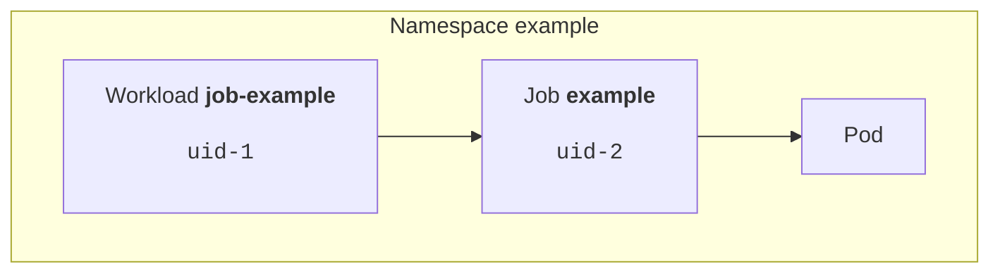

# Job Identifiers

## Terminology

In order to understand how jobq identifies jobs, it is important to understand the conceptual components of a workload:
A jobs is composed of an abstract definition of the workload (as a [Kueue `Workload`](https://kueue.sigs.k8s.io/docs/concepts/workload/) custom resource) and a set of Kubernetes resources (for example a Kubernetes `Job`, or a custom resource like the [Kuberay](https://docs.ray.io/en/latest/cluster/kubernetes/index.html) `RayJob`) that make up the executable part of the workload.

At first these similar-sounding names can be confusing, so let's establish some terminology:

-   A **workload** or **job** (lowercase "w"/"j") is a set of Kubernetes resources that make up the
    executable portion of a job.
-   A **Workload** (uppercase "W") refers to the Kueue `Workload` custom resource.
-   A **Job** (uppercase "J") refers to the Kubernetes `batch/v1/Job` resource (one way how code can be submitted through jobq).

Kueue handles the `Workload` and updates its status to reflect the current state of the workload.


## Identifying workloads

Every Workload (as managed by Kueue) carries by an automatically generated unique identifier (UID) as well as a human-readable name and namespace.
Both these could serve as a unique identifier for a Workload. However, a name/namespace combination is not guaranteed to be unique over time (for example when deleting and recreating), whereas UIDs are.
This makes UIDs a slightly better choice for identifying a given Workload resource.

The concrete workload resource has the same identifiers, a UID and name/namespace combination.

A given job references its associated Workload in a 1:1 fashion (through its `metadata.ownerReferences` field).

This theoretically allows to identify a job in the cluster through two different identifiers:

-   the UID of the (concrete) _job_ resource.
-   the UID of the (abstract) _Workload_ resource.

In practice, jobq always uses the **UID of the concrete workload** as the identifier for a job.
All CLI operations return and accept the UID of the concrete workload.

As an example, imagine the following resources in the cluster after submitting a job:



If we want to query the logs of the job, we can do so by calling `jobq logs` with the UID of the concrete workload:

```console
$ jobq logs uid-2
[... log output ...]
```
