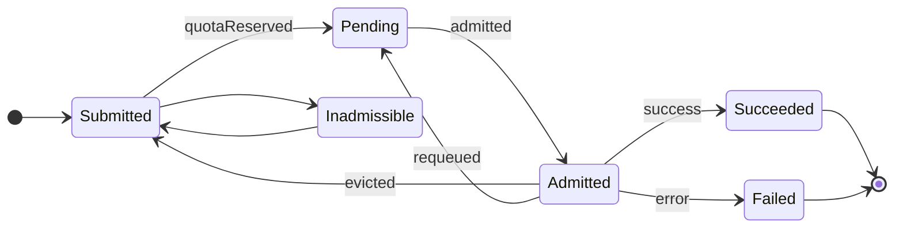

# Job Lifecycle

Since jobq builds on top of the [Kueue](https://kueue.sigs.k8s.io/) job queuing system for scheduling,
the lifecycle of a job is very similar to the lifecycle of a workload in Kueue.

The remainder of this document uses the terms _job_ and _workload_ interchangeably.

A workload roughly goes through three phases after its submission: _queuing and scheduling_, _execution_, and _completion_.

### Queueing and scheduling

After its submission, a workload is in the `Submitted` state, where it competes with other workloads for available resource quotas.
Once it is admitted to a cluster queue, it enters the `Pending` state, where Kueue will reserve a quota for it.
Alternatively, if the selected local or cluster queue for the workload are stopped or do not exist, the workload will enter the `Inadmissible` state until this condition is resolved.

### Execution

After all admission checks for the workload have passed, it enters the `Admitted` state, it is now eligible for execution by the cluster.

### Completion

When the workload terminates successfully, it enters the terminal `Succeeded` state.
If any unrecoverable error occurs during execution, the workload enters the terminal `Failed` state. This does not necessarily happen on the first abnormal termination of a pod, depending on the type of workload and other factors (such as the retry limit in a `batch/v1/Job`).

A currently executing workload may be preempted by another workload (e.g., by a newly submitted workload with a higher priority).
In this case, Kueue will terminate any pods associated with the preempted workload and either requeue it for later execution or evict it from the cluster queue.

## State Diagram

