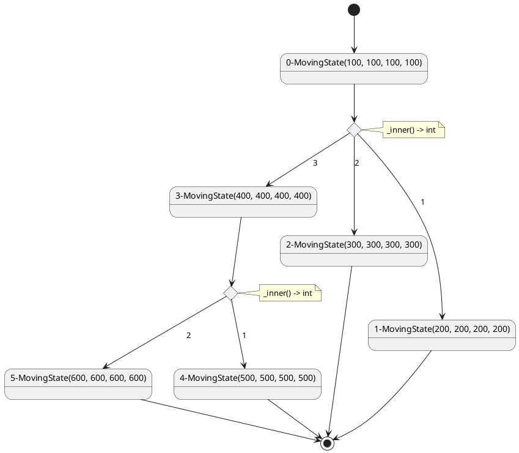
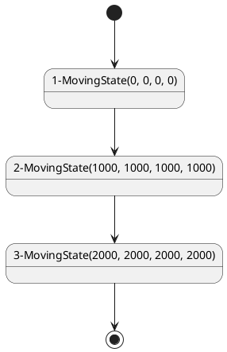

# mentabotix

> A dedicated lib to control 4-fixed-wheels robot
---

## Installation

Use `pdm` to install mentabotix

```shell
# install pdm
python -m pip install pdm

# config pdm
pdm config pypi.url https://pypi.tuna.tsinghua.edu.cn/simple

# for stable release
pdm add mentabotix

# for unstable release
pdm add mentabotix --pre

```

## Usage

### Menta

You can use `Menta` to create the judge function closure of the robot, using the sensor data as the input.

#### Step 1: Define Sampler Functions

Firstly, you need to define sampler functions that adhere to the specifications outlined by the `Menta` class. These
could include sequence samplers that return a series of data points, index samplers that provide data at a specific
index, and direct response samplers that give an immediate value.

|               Sampler                |                 Description                  |                    Type                    |
|:------------------------------------:|:--------------------------------------------:|:------------------------------------------:|
| `mentabotix.SamplerType.SEQ_SAMPLER` | The sensor data is returned in a `Sequence`. | `Callable[[], Sequence[Union[float,int]]]` |
| `mentabotix.SamplerType.IDX_SAMPLER` |         Use a index to get the data.         |    `Callable[[int], Union[float,int]]`     |
| `mentabotix.SamplerType.DRC_SAMPLER` |  Direct read sensor data without any args.   |      `Callable[[], Union[float,int]]`      |

> Do remember to add return type annotations to your sampler functions, which will be used to classify the samplers into
> their respective types in the `Menta` class.

```python

def temperature_sequence_sampler() -> list[float]:
    """Simulates a sequence of temperature readings."""
    return [25.5, 26.0, 25.8]


def humidity_index_sampler(index: int) -> float:
    """Returns simulated humidity data at a given index."""
    humidity_values = [45.0, 50.0, 55.0]
    return humidity_values[index]


def light_direct_sampler() -> float:
    """Provides the current light intensity reading."""
    return 750.0
```

#### Step 2: Initialize Menta Instance and Add Samplers

After defining the sampler functions, initialize the `Menta` instance and add these samplers to it.

```python
from mentabotix import Menta  # Ensure to import the correct Menta class


def temperature_sequence_sampler() -> list[float]:
    """Simulates a sequence of temperature readings."""
    return [25.5, 26.0, 25.8]


def humidity_index_sampler(index: int) -> float:
    """Returns simulated humidity data at a given index."""
    humidity_values = [45.0, 50.0, 55.0]
    return humidity_values[index]


def light_direct_sampler() -> float:
    """Provides the current light intensity reading."""
    return 750.0


menta_instance = Menta()
menta_instance.samplers.extend([temperature_sequence_sampler, humidity_index_sampler, light_direct_sampler])

```

#### Step 3: Update Sampler Types

Invoke the `update_sampler_types` method to automatically classify the samplers into their respective types.

```python
from mentabotix import Menta  # Ensure to import the correct Menta class


def temperature_sequence_sampler() -> list[float]:
    """Simulates a sequence of temperature readings."""
    return [25.5, 26.0, 25.8]


def humidity_index_sampler(index: int) -> float:
    """Returns simulated humidity data at a given index."""
    humidity_values = [45.0, 50.0, 55.0]
    return humidity_values[index]


def light_direct_sampler() -> float:
    """Provides the current light intensity reading."""
    return 750.0


menta_instance = Menta()
menta_instance.samplers.extend([temperature_sequence_sampler, humidity_index_sampler, light_direct_sampler])

menta_instance.update_sampler_types()
```

#### Step 4: Construct Judge Function

To use the samplers in a meaningful way, you can construct an updater function that encapsulates a condition based on
which system updates might occur. For example:

```python
from mentabotix import SamplerUsage, Menta


def temperature_sequence_sampler() -> list[float]:
    """Simulates a sequence of temperature readings."""
    return [25.5, 26.0, 25.8]


def humidity_index_sampler(index: int) -> float:
    """Returns simulated humidity data at a given index."""
    humidity_values = [45.0, 50.0, 55.0]
    return humidity_values[index]


def light_direct_sampler() -> float:
    """Provides the current light intensity reading."""
    return 750.0


menta_instance = Menta()
menta_instance.samplers.extend([temperature_sequence_sampler, humidity_index_sampler, light_direct_sampler])

menta_instance.update_sampler_types()

# Define how samplers will be used
usages = [

    # Use sequence sampler for first and third temp data
    SamplerUsage(used_sampler_index=0, required_data_indexes=[0, 2]),
    # Use index sampler for the first humidity value
    SamplerUsage(used_sampler_index=1, required_data_indexes=[0]),
]

# Note: the judge source has some built-in syntaxes.Currently, sensor data indexes flattening and extra data context insertion
# s0 stands for the data at index 0 of the first sampler
# s1 stands for the data at index 2 of the first sampler
# s3 stands for the data at index 1 of the second sampler

judging_source = "(s0 > 25 and s1 < 50) or s3>baseline"

# Extra context for the judge function, here only contains the "baseline"
extra_context = {"baseline": 47}

from typing import Callable

# Construct the judge function object
updater_function: Callable[[], bool] = menta_instance.construct_inlined_function(usages, judging_source=judging_source,
                                                                                 extra_context=extra_context)

# Use the judge function to update the system
updater_function()


# Below is the equivalent implementation of the judge function, but is defined manually. 
# It acts exactly the same as the `updater_function` above.
def manual_judge_function() -> bool:
    """Manually construct the judge function."""
    seq_temp = temperature_sequence_sampler()
    return (seq_temp[0] > 25 and seq_temp[2] < 50) or humidity_index_sampler(0) > 47
```

In this case, a judge function closure is created using `exec()` method.Normally the built should have a better
performance since the all the calls and variables are inlined and stored in the closure.
---

## Botix

Welcome to the guide on using Botix for state-transition control schema creation and compilation. This document will
walk you through the steps to design a control schema using state and transition concepts, and then how to compile those
schemas into executable closures using the Botix framework.

### Understanding State-Transition Control Schema

Let's start with the fundamental schema rules:
> - A `MovingState` **MUST** connect exactly **ONE** `MovingTransition` as its input state.
>- A `MovingTransition` **MUST** have at least **ONE** `MovingState` as either input or output.
>- A State-Transition Control Schema **MUST** have **EXACTLY ONE** `MovingState` as its initial state and **AT LEAST ONE
   ** `MovingState` as its final state.
>- A State-Transition Control Schema **MUST NOT** have any loop, a correct control schema should always be a tree graph.

Imagine you're designing an autonomous robot that needs to navigate different environments. Each behavior or action the
robot can take is represented by a **state**, such as "moving forward," "turning left," or "halt." Transitions between
these states are triggered by events or conditions, forming a **control schema**.

#### States

- In Botix, a state is represented by the `MovingState` class. Each state might have associated actions like setting
  motor speeds or changing direction.
- A state describe the robot's **moving behavior**, 4 motor speeds in this case

#### Transitions

- Transitions between states are handled by the `MovingTransition` class. They define how and when the robot moves from
  one state to another, possibly based on sensor inputs or internal conditions.
- Transitions describe how the robot **moves** from one state to another

### Building Your Control Schema

#### Step 1: Define States

For each distinct behavior, create a `MovingState` instance. Include the actions or configurations that should occur in
that state. For instance, creating a state for moving forward might look like this:

```python
from mentabotix import MovingState

# the most basic syntax to control the robot advance in a straight line with speed of 10
# speed of all motors is 10
moving_forward = MovingState(10)
# Speeds for left and right motors are 10
moving_forward = MovingState(10, 10)
# Speeds for, in order, front_left, rear_left, rear_right, front_right motors are 10
moving_forward = MovingState(10, 10, 10, 10)

# Use assistant method to create the state instance
moving_forward = MovingState.straight(10)
moving_backward = MovingState.straight(-10)

turn_left = MovingState.turn("l", 10)
turn_right = MovingState.turn("r", 10)

diff_move_left = MovingState.differential("l", radius=20, outer_speed=70)
diff_move_right = MovingState.differential("r", radius=20, outer_speed=70)

drift_fl = MovingState.drift("fl", 50)
drift_rl = MovingState.drift("rl", 50)
drift_rr = MovingState.drift("rr", 50)
drift_fr = MovingState.drift("fr", 50)

stopped_state = MovingState.halt()


```

#### Step 2: Define Transitions

Transitions are created with `MovingTransition`. Specify the duration, any conditions under which the transition should
occur (using a breaker function), and the source and destination states.

```python
from mentabotix import MovingTransition, MovingState
from random import random

sensor_reading = lambda: random()  # Example sensor reading function
threshold = 0.6


def stop_condition() -> bool:  # the return type must be annotated, since an exception will be raised otherwise
    return sensor_reading() < threshold


moving_forward = MovingState(10)
stopped_state = MovingState(0)

transition_forward_to_stop = MovingTransition(
    duration=2,  # Duration to transition
    breaker=stop_condition,  # When to break the transition
    from_states=moving_forward,
    to_states=stopped_state,
)
# Such transition indicate the bot will move forward for 2 seconds OR stop when the sensor reading is below 25.0 

```

But some time you might want to create a transition that branches out to other states. For example, if the robot needs
to move forward and then turn left. This can be done by creating a `MovingTransition` like this:

```python
from mentabotix import MovingTransition, MovingState
from random import choice


def stop_condition() -> int:  # return type must be annotated
    return choice([0, 1, 2])


moving_left = MovingState.turn("l", 10)
moving_right = MovingState.turn("r", 10)
moving_dash = MovingState.straight(100)
stopped_state = MovingState(0)

transition_forward_to_stop = MovingTransition(
    duration=2,  # Duration to transition
    breaker=stop_condition,  # When to break the transition
    from_states=stopped_state,
    to_states={1: moving_left, 2: moving_right, 0: moving_dash},
)

# Such transition indicate the bot will stop for 2 seconds and then dash forward if nothing happens. ( means the top_condition never return a Non-Zero value)

# If the stop_condition do return a Non-Zero value, 
# the 2-seconds stop will be broken and the bot will either turn left or right according to the value returned by the stop_condition. (means if the value is 1, it will turn left, if the value is 2, it will turn right)

```

#### Step 3: Connect States with Transitions

Create a collection of your states and transitions, ensuring each transition correctly references its source and target
states.

A legal control schema should have a start state and at least one end state.
And each state can **ONLY** connect to **ONE** transition as its input state

```python
from mentabotix import MovingState, MovingTransition
import random

moving_left = MovingState.turn("l", 10)
moving_right = MovingState.turn("r", 10)
moving_dash = MovingState.straight(100)
stopped_state = MovingState(0)

start_state = MovingState(100)


def _breaker_1() -> int:
    return random.choice([0, 1, 2])


def _breaker_2() -> int:
    return random.choice([0, 1])


transition_1 = MovingTransition(
    duration=2,  # Duration to transition
    breaker=_breaker_1,  # When to break the transition
    from_states=stopped_state,
    to_states={1: moving_left, 2: moving_right, 0: moving_dash},
)

transition_2 = MovingTransition(
    duration=2,  # Duration to transition
    breaker=_breaker_2,  # When to break the transition
    from_states=stopped_state,
    to_states={0: moving_dash, 1: stopped_state},
)


```

As the above example, `transition_1` and `transition_2` both have the `stopped_state` as the input state,which means
the `stopped_state` connects more than **ONE** transition. Definition as such is illegal and will not pass the compile
stage.

Normally, you can ensure that the structure is valid by using `ensure_structure_validity`. to eliminate this problem.

```python
from mentabotix import Botix

# A StructuralError will be raised if the structure is not valid
Botix.ensure_structure_validity([transition_1, transition_2])
```

### Compiling to Closures with Botix

Once your control schema is defined, Botix can help you compile this structure into executable code, often referred to
as closures, which can directly control the robot's behavior.

#### Step 4: Compile the Schema

Botix provides methods to compile your states and transitions into a Match-Case-Structured Closure.

```python
from mentabotix import MovingState, MovingTransition, Botix
from bdmc import CloseLoopController, MotorInfo

con: CloseLoopController = CloseLoopController(motor_infos=[MotorInfo(code_sign=3, direction=1),
                                                            MotorInfo(code_sign=1, direction=1),
                                                            MotorInfo(code_sign=2, direction=-1),
                                                            MotorInfo(code_sign=4, direction=-1)], port="COM3")

start_state = MovingState(-1)
state_a = MovingState(0)
state_b = MovingState(1)
state_c = MovingState(2)
# 创建一些假的MovingTransition对象用于测试
transition_start_a = MovingTransition(duration=0.1, from_states=start_state, to_states=state_a)
transition_ab = MovingTransition(duration=1, from_states=state_a, to_states=state_b)
transition_bc = MovingTransition(duration=2, from_states=state_b, to_states=state_c)

botix = Botix(controller=con)
botix.token_pool.append(transition_start_a)
botix.token_pool.append(transition_ab)
botix.token_pool.append(transition_bc)

# not compile the code into closure, just return the code lines and context, which is human readable.
compiled_code_lines, variables_context = botix.compile(return_median=True)

print(compiled_code_lines)


```

By printing out the `compiled_code_lines` list, you can see the code lines that are generated by Botix.

```python
[
    "def _func():",
    "    con.set_motors_speed((-1, -1, -1, -1)).delay(0.1).set_motors_speed((0, 0, 0, 0)).delay(1).set_motors_speed((1, 1, 1, 1)).delay(2).set_motors_speed((2, 2, 2, 2))",
]

```

But usually, you want to compile the code into a closure that can be used to control the robot with higher performance
and less human error.

```python
from mentabotix import MovingState, MovingTransition, Botix
from bdmc import CloseLoopController, MotorInfo
from typing import Callable

con: CloseLoopController = CloseLoopController(motor_infos=[MotorInfo(code_sign=3, direction=1),
                                                            MotorInfo(code_sign=1, direction=1),
                                                            MotorInfo(code_sign=2, direction=-1),
                                                            MotorInfo(code_sign=4, direction=-1)], port="COM3")

start_state = MovingState(-1)
state_a = MovingState(0)
state_b = MovingState(1)
state_c = MovingState(2)
# create some transitions
transition_start_a = MovingTransition(duration=0.1, from_states=start_state, to_states=state_a)
transition_ab = MovingTransition(duration=1, from_states=state_a, to_states=state_b)
transition_bc = MovingTransition(duration=2, from_states=state_b, to_states=state_c)

botix = Botix(controller=con)
botix.token_pool.append(transition_start_a)
botix.token_pool.append(transition_ab)
botix.token_pool.append(transition_bc)

# not compile the code into closure, just return the code lines and context, which is human-readable.
function_closure: Callable[[], None] = botix.compile(return_median=False)

print(function_closure)
```

By printing out the `function_closure` object, you can see the compiled code as a closure that can be called

```
< function _func at 0x0000020D40EAECA0 >
```

Usage is as follows

```python
# call the closure, which will execute the compiled code
function_closure()
```

Of course, you can also build a closure with branching logic in it.

```python
from mentabotix import MovingState, MovingTransition, Botix
from bdmc import CloseLoopController, MotorInfo
import random
from typing import List, Tuple, Dict, Any, Callable

controller: CloseLoopController = CloseLoopController(
    motor_infos=[MotorInfo(code_sign=3, direction=1),
                 MotorInfo(code_sign=1, direction=1),
                 MotorInfo(code_sign=2, direction=-1),
                 MotorInfo(code_sign=4, direction=-1)], port="COM3"
)

botix = Botix(controller=controller)
state_a = MovingState(100)
state_b = MovingState(200)
state_c = MovingState(300)
state_d = MovingState(400)
state_e = MovingState(500)
state_f = MovingState(600)


def transition_breaker_fac(lst: List[int]):  # a simple tool function to create the breaker
    def _inner() -> int:
        return random.choice(lst)

    return _inner


transition_a_bcd = MovingTransition(
    duration=1,
    from_states=state_a,
    to_states={0: state_b, 1: state_c, 2: state_d},
    breaker=transition_breaker_fac([0, 1, 2]),
)
transition_d_ef = MovingTransition(
    duration=1,
    from_states=state_d,
    to_states={2: state_e, 1: state_f},
    breaker=transition_breaker_fac([0, 1]),
)

botix.token_pool.extend([transition_a_bcd, transition_d_ef])

compiled: Tuple[List[str], Dict[str, Any]] = botix.compile(
    return_median=True)  # not compile the code into closure, just return the code lines and context, which is human readable.
assert (
    [
        "def _func():",
        "    match con.set_motors_speed((100, 100, 100, 100)).delay_b_match(1,transition0_breaker_1,0.01):",
        "        case 0:",
        "            con.set_motors_speed((200, 200, 200, 200))",
        "        case 1:",
        "            con.set_motors_speed((300, 300, 300, 300))",
        "        case 2:",
        "            match con.set_motors_speed((400, 400, 400, 400)).delay_b_match(1,transition1_breaker_1,0.01):",
        "                case 0:",
        "                    con.set_motors_speed((500, 500, 500, 500))",
        "                case 1:",
        "                    con.set_motors_speed((600, 600, 600, 600))",
    ] == compiled[0],
)

# compile to closure
compiled_closure: Callable[[], None] = botix.compile(return_median=False)

# call the closure, which will execute the compiled code
compiled_closure()


```

### Schema Visualization

Botix support schema visualization with `export_structure` method, which write Puml source code to a file.

```python
from mentabotix import MovingState, MovingTransition, Botix
from bdmc import CloseLoopController, MotorInfo
from typing import List
import random

# init the state-transition schema
state_a = MovingState(100)
state_b = MovingState(200)
state_c = MovingState(300)
state_d = MovingState(400)
state_e = MovingState(500)
state_f = MovingState(600)


def transition_breaker_fac(lst: List[int]):
    def _inner() -> int:
        return random.choice(lst)

    return _inner


transition_a_bcd = MovingTransition(
    duration=1,
    from_states=state_a,
    to_states={1: state_b, 2: state_c, 3: state_d},
    breaker=transition_breaker_fac([1, 2, 3]),
)
transition_d_ef = MovingTransition(
    duration=1,
    from_states=state_d,
    to_states={1: state_e, 2: state_f},
    breaker=transition_breaker_fac([1, 2]),
)

# make the botix object
botix = Botix(controller=CloseLoopController(motor_infos=[MotorInfo(i) for i in range(4)], port="COM3"))

# add the transition
botix.token_pool.extend([transition_a_bcd, transition_d_ef])

# export the structure
Botix.export_structure("schema.puml", botix.token_pool)
```

The result will be written to `schema.puml` and below is the expected Puml source code.



Below is the expected render result:


### Use State-Transition Composer

State-Transition Composer is a tool that helps you to design and compile state-transition control schema.

```python
from mentabotix import MovingChainComposer, MovingState, MovingTransition, Botix
from bdmc import CloseLoopController, MotorInfo

# init the state-transition composer
comp = MovingChainComposer()

# add some states and transitions one by one to the composer, the composer will auto-connect the states and transitions
(comp
 .add(MovingState(0))
 .add(MovingTransition(0.2))
 .add(MovingState(1000))
 .add(MovingTransition(0.3))
 .add(MovingState(2000)))

# export the structure
states, transitions = comp.export_structure()

# let's use botix to make the visualization!
# first make the botix object
con = CloseLoopController(motor_infos=[MotorInfo(i) for i in range(4)])
botix = Botix(controller=con)

# make the visualization
Botix.export_structure("composed.puml", transitions=transitions)
```

The exported structure will be written to `composed.puml`, and below is the expected Puml source code.



The render result is shown below:


## Logging

use `set_log_level` to silent the console to improve the performance in high pressure conditions

```python
from mentabotix import set_log_level

"""
Logging DEBUG - Debugging information, used for detailed development phase logs, typically with a value of 10.
Logging INFO - Information message, used to inform the general program running status, with a value of 20.
Logging WARN - A warning message indicating that there may be a problem but the program is still running, with a value of 30.
Logging Error - Error message indicating an issue preventing the program from executing properly, with a value of 40.
Logging CRITICAL - Fatal error message indicating a serious system failure with a value of 50.
"""

set_log_level(50)  # set the log-level to 50, which makes logger only print the msg important than the CRITICAL logging

from logging import CRITICAL

set_log_level(CRITICAL)  # this has the same effect as above
```
